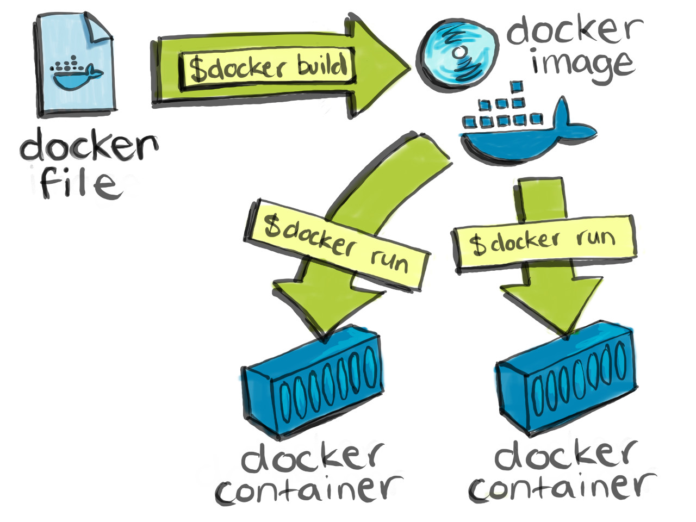

## Docker

What is Docker?

Docker is a containerization platform that packages your application and all its dependencies together in the form of a docker container to ensure that your application works seamlessly in any environment.

What is Container?

Docker Container is a standardized unit which can be created on the fly to deploy a particular application or environment. It could be an Ubuntu container, CentOs container, etc. to full-fill the requirement from an operating system point of view. Also, it could be an application oriented container like CakePHP container or a Tomcat-Ubuntu container etc.

Why use containers?

Containers offer a logical packaging mechanism in which applications can be abstracted from the environment in which they actually run. This decoupling allows container-based applications to be deployed easily and consistently, regardless of whether the target environment is a private data center, the public cloud, or even a developer’s personal laptop. This gives developers the ability to create predictable environments that are isolated from rest of the applications and can be run anywhere.

## It All Starts With a Dockerfile

 

A Dockerfile is a file that you create which in turn produces a Docker image when you build it.

A Dockerfile is a text file that Docker reads in from top to bottom. It contains a bunch of instructions which informs Docker HOW the Docker image should get built.

The act of running a Docker image creates a Docker container, that’s it.

A Dockerfile is a recipe for creating Docker images
A Docker image gets built by running a Docker command (which uses that Dockerfile)
A Docker container is a running instance of a Docker image

[Docker Tutorial](https://docs.docker.com/get-started/)
