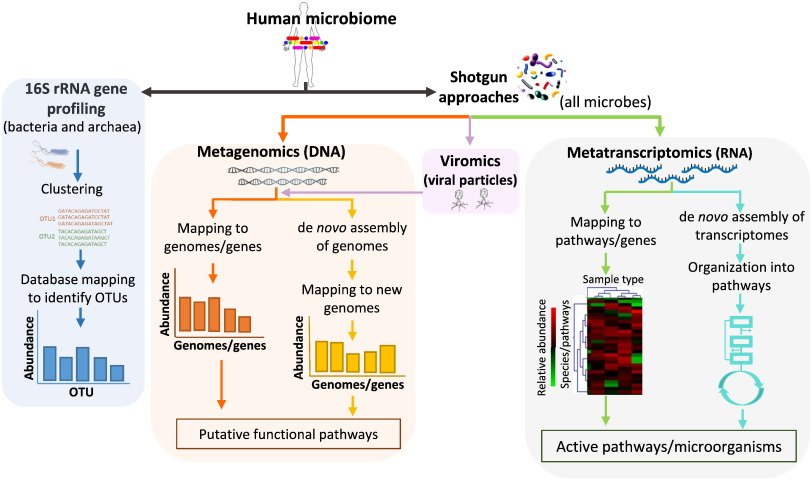
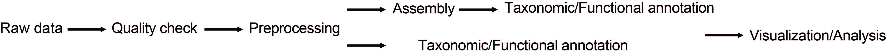

DNA sequencing has revolutionized microbial ecology. There are two orthogonal approaches commonly used to explore the microbial universe: amplicon where a part of a single gene (usually the 16S rRNA gene) is amplified and sequenced and untargeted (“shotgun”) sequencing of all (“meta”) microbial genomes (“genomics”) where all the DNA is extracted and sequenced. 16S rRNA sequencing provides a rapid, portable and cheap method to identify bacterial organisms in a sample. Drawbacks of this technique are its low taxonomic resolution (typically only to the genus level), its inability to identify community members from other phylogenetic kingdoms or tell us what functional genes are present in a given community. Shotgun metagenomics allows for finer taxonomic resolution (species and/or strain level), cross kingdom identification and details about what genes microbial organisms are carrying in a given community.

<p align="center">
 
</p>

Data analysis pipelines will always follow a pretty standard workflow. Once you understand this, then you will be able to apply these same ideas to other omics technologies using a different set of tools. 


<p align="center">
 
</p>

## Mock Communities
To assess the performance of different microbiome workflows, there is an urgent need in the field for reliable reference materials, e.g. a mock microbial community with defined composition. 

When analyzing your dataset keep in mind that if your raw read is similar enough to anything in your reference database and your alignment parameters are 'loose' enough then it will align to that; however, you should always be skeptical of your output if you have not done the proper optimization of have a full understanding of your pipeline is doing. You are the bioinformatician and you need to be comfortable and confident in your pipeline. Sometimes you will just insert your raw reads to an online repository and press a button and you will get an output. How did they get that output, what were their parameters, their cutoffs, how confident are you in their results? Sometimes you will have to create your own pipeline and there will not be a solid blueprint - you are now the trailblazer and bioinformatician. So how can we be confident that we are going in the right direction? The simplest answer right now is understand what parameters you used and why (yes this means actually reading the papers pertaining to a given tool and figuring out if the default parameters are your best choice) and test your pipeline using a mock community.

There are a number of public resources for microbiome bioinformatics benchmarking using artificially constructed (i.e., mock) communities. The one that we will use in this tutorial will be a subset of the [ZymoBiomics Mock Community](https://www.zymoresearch.com/blogs/blog/zymobiomics-microbial-standards-optimize-your-microbiomics-workflow). 


# Shotgun Metagenomic Basic Workflow
```bash
git clone https://github.com/pjtorres/metagenomics_tutorial.git
```

### 1. Quality Control

As the old saying goes 'Garbage in garbage out'. This saying applies to a lot of things including shotgun metagenomic reads. Remember that your are classifying reads based on their similarity to other known reads in your reference database. If your reads are too short they will align to a lot of different genomes, if there is too much error (low sequencing quality) you will make too many erroneous alignments or non at all. These errors will can cause problems will become more apparent as you start analyzing your data and come to find elephant virus exist in your mouth! OMG!

You should check the quality of your data  with programs such as [FastQC](http://www.bioinformatics.babraham.ac.uk/projects/fastqc/). This is an easy drag and drop approach and you will get an html output. You can see and example of it in  ```mock_community/insub732_2_R1_fastqc.html```.

This is great but imagine having to do this for 100 files, oy vey!

On top of that you will also need to preprocess your reads. This means you need to remove filter out bad reads (reads that are too short -typically <=60bp, or of too low quality, too many N's). Need top cut low quality bases in the 5' and 3' region, and removal of adaptors ect. 

Programs you can use include [Trimmomatic](http://www.usadellab.org/cms/?page=trimmomatic), [TagCleaner](http://tagcleaner.sourceforge.net/), [prinseq++](https://github.com/Adrian-Cantu/PRINSEQ-plus-plus). Today we will use [fastp](https://github.com/OpenGene/fastp) which allows you to kill two birds with one stone:1. check quality of data and 2. preprocess your reads! 

a. Lets build our [Docker Image](https://www.docker.com/)
 
```bash
docker build -t metagenomics .
```


Make sure it works
```bash
docker run -v `pwd`:`pwd` -w `pwd` metagenomics fastp --help
```
b. build a new directory to help keep things organied. Your futture self will thank you!
```bash
mkdir 1_QC
```
c. Run fastp
```bash
docker run -v `pwd`:`pwd` -w `pwd` metagenomics fastp \
     -i mock_community/insub732_2_R1.fastq.gz \
     -I mock_community/insub732_2_R2.fastq.gz \
     -o 1_QC/insub732_2_R1_fastp.fastq.gz \
     -O 1_QC/insub732_2_R2.fastp.fastq.gz \
     --detect_adapter_for_pe --length_required 60 --html 1_QC/insub732_2.fastp.html
```
### 2. Remove host contamination 
Removing host (contamination) sequences is important to analyze the renaming (non-host) sequences. This is important step needed especially if you are planning of building contigs or submitting human data to a public repository like the SRA. We will use a variety of popular tools to do this including bowtie2, samtools, and bedtools. **Big thank you to Bryan Ho for doing this**

a. Someone already build the docker images yay! We can go ahead and pull the [bowtie2](https://hub.docker.com/r/biocontainers/bowtie2/), the [samtools](https://hub.docker.com/r/biocontainers/samtools/) and [bedtools](https://hub.docker.com/r/biocontainers/bedtools)pre-made image form the docker repository 

```bash
docker pull biocontainers/bowtie2:v2.2.9_cv2

docker pull biocontainers/samtools:v1.2_cv3

docker pull biocontainers/bedtools:v2.25.0_cv3
```

For this tutorial I will use a small sample of the human reference genome to align our reads against. You can change this to whatever organism it is that you are interested in (mouse, rat, fish, virus, ect.). You can download some pre-indexed ones from the [bowtie2 website](http://bowtie-bio.sourceforge.net/bowtie2/manual.shtml) or download your own. We will build our own small one right now.

b. Make appropriate directories for later and download human reference
```bash
mkdir refdb
mkdir 2_Decontam
```

```bash
 wget ftp://hgdownload.cse.ucsc.edu/goldenPath/hg19/chromosomes/chr19.fa.gz
```

```bash
mv chr19.fa.gz refdb/
unzip refdb/chr19.fa.gz
```
c. Index reference genome
```bash
docker run -v `pwd`:`pwd` -w `pwd` biocontainers/bowtie2:v2.2.9_cv2 bowtie2-build refdb/chr19.fa refdb/human19
```
Run the following to check if it was build properly. You should not get any errors:
```bash
docker run -v `pwd`:`pwd` -w `pwd` biocontainers/bowtie2:v2.2.9_cv2 bowtie2-inspect -s refdb/human19
```
d. Align your reads to the reference database
```bash
docker run -v `pwd`:`pwd` -w `pwd` biocontainers/bowtie2:v2.2.9_cv2 bowtie2 -x refdb/human19 -1 1_QC/insub732_2_R1_fastp.fastq.gz -2 1_QC/insub732_2_R2.fastp.fastq.gz -S 2_Decontam/insub732_mapped_and_unmapped.sam
```

e. Samtools to convert sam to bam. 
To do anything meaningful with alignment data from BWA or other aligners (which produce text-based SAM output), we need to first convert the SAM to its binary counterpart, BAM format. The binary format is much easier for computer programs to work with. However, it is consequently very difficult for humans to read. More on that later.

To convert SAM to BAM, we use the samtools view command. We must specify that our input is in SAM format (by default it expects BAM) using the -S option. We must also say that we want the output to be BAM (by default it produces BAM) with the -b option. Samtools follows the UNIX convention of sending its output to the UNIX STDOUT, so we need to use a redirect operator (“>”) to create a BAM file from the output.


```bash
docker run -v `pwd`:`pwd` -w `pwd` biocontainers/samtools:v1.2_cv3 samtools view -bS 2_Decontam/insub732_mapped_and_unmapped.sam > 2_Decontam/insub732_mapped_and_unmapped.bam
```

f. Extract out the unmapped reads against the mouse genome (don't want mapped, those are host genome contamination) only want reads that are both ends unmapped. [Both reads of the pair are unmapped](http://seqanswers.com/forums/showthread.php?t=12283)

```bash
docker run -v `pwd`:`pwd` -w `pwd` biocontainers/samtools:v1.2_cv3 samtools view -b -f 12 -F 256 2_Decontam/insub732_mapped_and_unmapped.bam > 2_Decontam/insub732_NA_human.bam
```

g. Before we convert the bam file to fastq we must sort the file such that the alignments occur in “genome order”. That is, ordered positionally based upon their alignment coordinates on each chromosome.

```bash
docker run -v `pwd`:`pwd` -w `pwd` biocontainers/samtools:v1.2_cv3 samtools sort  2_Decontam/insub732_NA_human.bam   2_Decontam/insub732_NA_human_sorted
```
e. Se will now convert the bam file to fastq. bedtools bamtofastq is a conversion utility for extracting FASTQ records from sequence alignments in BAM format.

```bash
docker run -v `pwd`:`pwd` -w `pwd` biocontainers/bedtools:v2.25.0_cv3 bedtools bamtofastq -i 2_Decontam/insub732_NA_human_sorted.bam -fq 2_Decontam/insub732_R1_NA_human_sorted.fastq -fq2 2_Decontam/insub732_R2_NA_human_sorted.fastq 
```
### 3. Taxonomic Classificaiton

There are a number of classification progrmas out there: [centrifuge](https://ccb.jhu.edu/software/centrifuge/) [kraken](https://ccb.jhu.edu/software/kraken/), [kaiju](http://kaiju.binf.ku.dk/), [mOTU](https://omictools.com/motu-tool), [BLAST](https://blast.ncbi.nlm.nih.gov/Blast.cgi), [FOCUS](https://github.com/metageni/FOCUS) ... you get the picture. There are a lot! It is up to you to decide what works best for your given dataset. I am a fan of centrifuge, but there is alot of processing invovled in order to make it human readable. For the sake of this tutorial I will use [metaphlan2](https://bitbucket.org/biobakery/metaphlan2). T

a. Once again let us use a someone elses docker image :)
```bash
docker pull qhmu/metaphlan2
```
This time I will show you how you can go inside of the docker container so that we do not have to type ```docker run -v `pwd`:`pwd` -w `pwd` ``` everytime you want to run something. 

```bash
sudo docker run -v `pwd`:`pwd` -w `pwd` -it  qhmu/metaphlan2-docker:latest 
```
-i interactive
-t terminal

You should see something like ```root@af273de96f4a:/home/ubuntu#``` . This means you are running docker interactively on your computer now.

Type ```metaphlan2.py``` to test it.

Run with paired end reads
```bash
metaphlan2.py subset_in745_2_R1.fastq.gz,subset_in745_2_R2.fastq.gz \
              --bowtie2out subset_in745.bowtie2.bz2 \
              --mpa_pkl db_v20/mpa_v20_m200.pkl \
              --bowtie2db db_v20/mpa_v20_m200 \
              --input_type fastq 
```


## Extra
What is Docker ?
Docker is a containerization platform that packages your application and all its dependencies together in the form of a docker container to ensure that your application works seamlessly in any environment.

What is Container ?
Docker Container is a standardized unit which can be created on the fly to deploy a particular application or environment. It could be an Ubuntu container, CentOs container, etc. to full-fill the requirement from an operating system point of view. Also, it could be an application oriented container like CakePHP container or a Tomcat-Ubuntu container etc.
[Docker Tutorial](https://docs.docker.com/get-started/)

Great [tutorial](https://wikis.utexas.edu/display/bioiteam/Mapping+with+bowtie2+Tutorial?preview=/66698154/67961035/Barrick_IntroToReadMapping_GVA14.pdf) on sequence alignment and the tools we went over above 
